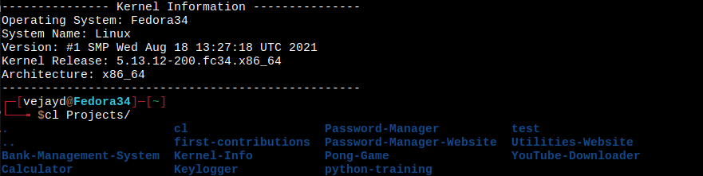

# cl
This bash script is used to change directories and list all the folders and files at once.

# Usage
This command uses the [cd](https://en.wikipedia.org/wiki/Cd_(command)) and [ls](https://en.wikipedia.org/wiki/Ls) commands that are standard in Unix and Unix-like operating systems.
To use the cl command, you would use it as you would the [cd](https://en.wikipedia.org/wiki/Cd_(command)) command. 


# Installation/Setup
## Auto Install
I have made the setup of this tool really easy by creating a [install.sh](install.sh) file.
To get started using the cl command all you have to do is copy and paste the following command intoyour terminal.
```bash
git clone https://github.com/VejayDrepaul/cl
cd cl
sh install.sh
```
## Manual Install
If you choose to setup cl manually follow the instruction put below.
```bash
git clone https://github.com/VejayDrepaul/cl
cp .cl.sh ~
cd
chmod +x .cl.sh
echo "source ~/.cl.sh" > ~/.bashrc
source ~/.bashrc
```
